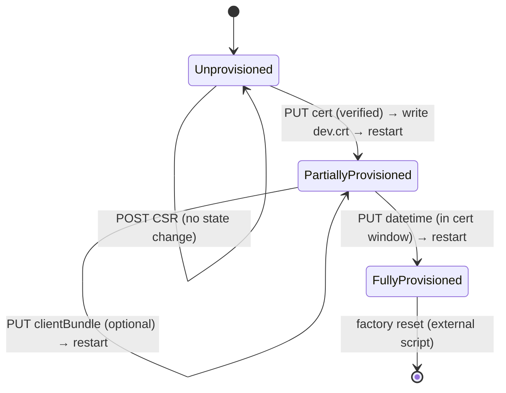

# Provisioning Flow

This document is the source-of-truth description of the provisioning mode in
`summit-rcm`, derived from the Python implementation in
`externals/summit-rcm/summit_rcm/plugins/provisioning/`. The Rust port in this
crate is expected to behave identically; deviations are bugs.

Provisioning is **not** an ordinary plugin: it is a special operating mode of
the daemon. While unprovisioned, the HTTP/TLS configuration is restricted, only
a small allow-list of endpoints is reachable, and the device transitions
through a small state machine that is driven by a sequence of REST requests.

## States

There are exactly three states, persisted as a single integer in
`/etc/summit-rcm/provisioning/state` (overridable via env var
`SUMMIT_RCM_PROVISIONING_STATE_FILE`).

| Value | State                  | Meaning                                      |
| ----- | ---------------------- | -------------------------------------------- |
| `0`   | `Unprovisioned`        | Default on first boot. Self-signed provisioning cert in use. Only allow-listed endpoints respond. |
| `1`   | `PartiallyProvisioned` | Device certificate has been installed but time has not yet been set. |
| `2`   | `FullyProvisioned`     | Device cert installed and time has been set within its validity window. Normal operation. |

If the state file is missing or unreadable, the daemon treats it as
`Unprovisioned` and rewrites it.

Python source: `summit_rcm/plugins/provisioning/summit_rcm_provisioning/services/provisioning_service.py`
(`ProvisioningState`, `get_provisioning_state`, `set_provisioning_state`).

Rust source: [src/plugins/provisioning/service.rs](../src/plugins/provisioning/service.rs)
(`ProvisioningState`, `CertificateProvisioningService::get_provisioning_state_async`,
`set_provisioning_state_async`).

## Startup behaviour per state

The provisioning state is read once at startup and used to choose the TLS
material the HTTP server presents.

| State                   | Server cert / key                                                  | Client-cert verification                                  | Trust store rebuilt? | syslog banner                          |
| ----------------------- | ------------------------------------------------------------------ | --------------------------------------------------------- | -------------------- | -------------------------------------- |
| `Unprovisioned`         | `/etc/summit-rcm/ssl/provisioning.{crt,key}` (self-signed)         | Disabled                                                  | Yes (if pairing on)  | `*** RESTRICTED PROVISIONING MODE ***` |
| `PartiallyProvisioned`  | `/etc/summit-rcm/provisioning/dev.{crt,key}` (uploaded device cert)| Enforced if either `enable_client_pairing` or `enable_client_auth` is set | Yes (if pairing on)  | `*** PARTIALLY PROVISIONED MODE ***`   |
| `FullyProvisioned`      | Device cert/key                                                    | Enforced only if `enable_client_auth` is set              | No                   | (none)                                 |

When the trust store is rebuilt, it is the concatenation of the read-only CA
file (`rodata_ca_cert_path` config) and, if present, the paired client
certificate (`paired_client_cert_path` config). The result is written to the
configured `server.ssl_certificate_chain` path (default
`/etc/summit-rcm/ssl/ca.crt`).

Python source: `summit_rcm/plugins/provisioning/summit_rcm_provisioning/__init__.py`
(`server_config_preload_hook`, `server_config_postload_hook`).

Rust source: [src/plugins/provisioning/service.rs](../src/plugins/provisioning/service.rs)
(`resolve_web_tls_config`, `web_tls_overrides`, `rebuild_web_tls_trust_store`).

## Allow-list while not fully provisioned

While in `Unprovisioned`, only paths in `UNPROVISIONED_PATH_WHITE_LIST` are
allowed; everything else returns HTTP `401 Unauthorized`. While in
`PartiallyProvisioned` with `enable_client_pairing=true`, the allow-list is
bypassed and access is gated by TLS client certificate match instead.

The Python list (the canonical source of truth):

```python
# summit_rcm/plugins/provisioning/summit_rcm_provisioning/middleware/certificate_provisioning_middleware.py
UNPROVISIONED_PATH_WHITE_LIST = [
    # legacy
    "/datetime",
    "/certificateProvisioning",
    "/networkStatus",
    "/version",
    "/poweroff",
    "/reboot",
    # v2
    "/api/v2/system/datetime",
    "/api/v2/system/certificateProvisioning",
    "/api/v2/system/certificateProvisioning/clientBundle",
    "/api/v2/network/status",
    "/api/v2/system/version",
    "/api/v2/system/power",
]
```

When the API docs are enabled (`DOCS_GENERATION=True`), `/`, `/api/docs` and
`/api/openapi.json` are also allowed.

> **Rust note** — the Rust port does **not** keep this list as a runtime
> string table. The same admit/deny decision is encoded as per-route
> [`RouteMode`](#route-mode-and-build-time-eviction) metadata and applied
> once at router build time. See the architecture section below.

Rust source: [src/plugins/provisioning/middleware.rs](../src/plugins/provisioning/middleware.rs).

## Provisioning REST endpoints

All endpoints below exist in both API versions (legacy and v2). Method and path
shape match between versions; the difference is the response envelope (legacy
`SDCERR`/`InfoMsg` vs. v2 typed JSON).

### `GET /certificateProvisioning` &nbsp;·&nbsp; `GET /api/v2/system/certificateProvisioning`

* **Registered only in `Provisioning` boot mode.**
* **Allowed in any state.**
* Returns the current state value.

### `POST /certificateProvisioning` &nbsp;·&nbsp; `POST /api/v2/system/certificateProvisioning`

* **Registered only in `Provisioning` boot mode.**
* **Allowed only in `Unprovisioned`** (rejects with HTTP 400 otherwise).
* Multipart form: `configFile` (OpenSSL `.cnf`), optional `opensslKeyGenArgs`.
* Generates `/etc/summit-rcm/provisioning/dev.key` and
  `/etc/summit-rcm/provisioning/dev.csr`.
* Returns the CSR in the response body.
* **Does not change state.**

### `PUT /certificateProvisioning` &nbsp;·&nbsp; `PUT /api/v2/system/certificateProvisioning`

* **Registered only in `Provisioning` boot mode.**
* **Allowed only in `Unprovisioned`** (rejects with HTTP 400 otherwise).
* Multipart form: `certificate` (`.crt` or `.pem`).
* Verifies the cert against `/etc/summit-rcm/ssl/provisioning.ca.crt` using
  `openssl verify -CAfile`.
* On success: writes `/etc/summit-rcm/provisioning/dev.crt`, transitions
  state to `PartiallyProvisioned`, schedules a 100 ms-delayed
  `summit-rcm.service` restart so the response can flush before the daemon
  reloads.

### `PUT /api/v2/system/certificateProvisioning/clientBundle`

* **Registered only in `Provisioning` boot mode.**
* **Available only when `enable_client_pairing=true`.**
* **Allowed only in `PartiallyProvisioned`** (rejects with HTTP 400 otherwise).
* Multipart form: `certificate` (`.crt` or `.pem`).
* Writes the cert to `paired_client_cert_path`. The trust store is rebuilt on
  the next startup (after the scheduled restart).
* Schedules a 100 ms-delayed restart.

### `PUT /datetime` &nbsp;·&nbsp; `PUT /api/v2/system/datetime` (in `PartiallyProvisioned`)

This is the transition out of `PartiallyProvisioned`. It is implemented in the
date-time route, not the provisioning route.

* The timestamp must fall inside the device certificate's validity window
  (`notBefore < t < notAfter`); a timestamp outside the window is rejected.
* On a successful manual time set while in `PartiallyProvisioned`, the daemon
  transitions to `FullyProvisioned` and schedules a 100 ms-delayed restart.

## State transitions



Each state-changing transition writes the state file, returns the HTTP
response, and only then performs `systemctl restart summit-rcm.service`
(scheduled with a 100 ms delay).

## Persistence summary

| Trigger                            | Files written                                                                                       |
| ---------------------------------- | --------------------------------------------------------------------------------------------------- |
| First boot                         | `/etc/summit-rcm/provisioning/state` ← `0`                                                          |
| `POST /certificateProvisioning`    | `/etc/summit-rcm/provisioning/dev.key`, `/etc/summit-rcm/provisioning/dev.csr`                       |
| `PUT /certificateProvisioning`     | `/etc/summit-rcm/provisioning/dev.crt`, `state` ← `1`                                                |
| `PUT clientBundle`                 | `paired_client_cert_path` (config-dependent)                                                         |
| `PUT /datetime` while `Partial`    | `state` ← `2`, `/etc/fallback_timestamp` mtime updated                                               |

## Exit from provisioning

* **Forward** (`Partial → Full`): automatic, on a successful manual time set
  whose timestamp lies inside the device cert validity window.
* **Backward** (`Full → Unprovisioned`): only via factory reset
  (`PUT /factoryReset` → `/usr/sbin/do_factory_reset.sh`), which removes the
  state file and the device cert/key. Provisioning has no in-process
  "deprovision" path.

## Plugin allow-list (mode-restricted plugins)

Only a subset of plugins is meant to function before provisioning is
complete. In the Rust port this is encoded as per-route
[`RouteMode`](#route-mode-and-build-time-eviction) metadata; the central
hardcoded path table from the Python port is gone.

## Route mode and build-time eviction

The Rust port treats provisioning as a **boot-time daemon mode**, not a
request-time policy. The mode is decided once when the daemon starts and
cannot change without a process restart, because:

* The HTTP listener's TLS material (server cert/key, client-cert verification,
  trust store) is selected at startup from the persisted `state` file. A
  state transition swaps that material on disk and arms a 100 ms-delayed
  `systemctl restart summit-rcm.service` so the new TLS configuration takes
  effect on the next boot.
* The set of reachable routes differs by mode, and so do the request-pipeline
  layers (`require_session`, the fallback-timestamp tracker, etc.).

Because transitions cycle through a restart, there is no value in runtime
gating; the router is built for exactly one mode per process lifetime.

### `BootMode`

Computed once and cached by
[`provisioning::current_boot_mode()`](../src/plugins/provisioning/mod.rs):

| `BootMode`       | Selected when                                                                                              |
| ---------------- | ---------------------------------------------------------------------------------------------------------- |
| `Normal`         | `enable_client_pairing=false`, **or** the persisted state is `FullyProvisioned`.                           |
| `Provisioning`   | `enable_client_pairing=true` **and** the persisted state is `Unprovisioned` or `PartiallyProvisioned`.     |

If the state file is missing or malformed, the daemon defaults to
`Unprovisioned` (i.e. `Provisioning` mode under pairing).

### `RouteMode`

Each published route declares which boot modes it is reachable in. The enum
lives in [`summit_rcm_plugin_api`](../crates/plugin-api/src/lib.rs) so
out-of-tree plugins can use the same vocabulary.

| `RouteMode`            | Typical declarations                                | Registered in `Unprovisioned` | Registered in `PartiallyProvisioned` | Registered in `FullyProvisioned` |
| ---------------------- | --------------------------------------------------- | :----------------------------: | :----------------------------------: | :------------------------------: |
| `FullyProvisioned`     | `protected FullyProvisioned "/path" => { ... }`    |              no                |                 no                   |               yes                |
| `NotFullyProvisioned`  | `protected NotFullyProvisioned "/path" => { ... }` |              yes               |                 yes                  |               no                 |
| `SomeProvisioning`     | `protected SomeProvisioning "/path" => { ... }`    |              no                |                 yes                  |               yes                |
| `Any`                 | `public Any "/path" => { ... }`                    |              yes               |                 yes                  |               yes                |

### How to choose a `RouteMode`

Think of `RouteMode` as a **set of boot states**, not as a synonym for the
persisted provisioning state integer.

There are three boot states:

* `Unprovisioned`
* `PartiallyProvisioned`
* `FullyProvisioned`

`RouteMode` selects which of those states should register a route at router
build time.

#### Use `Any`

Choose `Any` when a route should always exist regardless of provisioning
progress.

Typical examples:

* public login endpoints
* version/status endpoints that must remain reachable throughout provisioning
* provisioning state readout endpoints

Example:

* `public Any "/api/v2/login" => { ... }`

#### Use `FullyProvisioned`

Choose `FullyProvisioned` when a route is part of normal operation and must be
hidden until provisioning is complete.

Typical examples:

* the normal date-time handler
* routes that should not exist before the device has fully entered normal mode

Example:

* `protected FullyProvisioned "/api/v2/system/datetime" => { ... }`

#### Use `NotFullyProvisioned`

Choose `NotFullyProvisioned` when a route belongs to the provisioning flow and
must exist in both provisioning-phase boots:

* `Unprovisioned`
* `PartiallyProvisioned`

but must disappear once the daemon is fully provisioned.

Typical examples:

* provisioning datetime override
* certificate-upload / provisioning helper endpoints that stay valid until the
  final transition to full mode

Example:

* `protected NotFullyProvisioned "/api/v2/system/datetime" => { ... }`

#### Use `SomeProvisioning`

Choose `SomeProvisioning` when a route should be hidden only from the earliest,
restricted `Unprovisioned` boot, but should exist once some provisioning has
completed and continue existing in normal operation:

* `PartiallyProvisioned`
* `FullyProvisioned`

Typical examples:

* configuration and management routes that should stay locked out before the
  device certificate is installed
* authenticated user-management or network-editing routes

Example:

* `protected SomeProvisioning "/api/v2/login/users" => { ... }`

### Practical decision rules

When adding a route, ask these questions in order:

1. Should it exist in all boot states?
  * Yes → `Any`
2. Should it exist only after provisioning is completely done?
  * Yes → `FullyProvisioned`
3. Should it exist only before provisioning is completely done?
  * Yes → `NotFullyProvisioned`
4. Should it be hidden only from the earliest unprovisioned state, but present
  afterward?
  * Yes → `SomeProvisioning`

If none of those buckets match cleanly, reconsider the route's ownership or
whether the handler should reject based on live provisioning state rather than
introducing a new visibility policy.

Routes with an inadmissible mode are **not registered** with axum at all —
they are evicted from the router during [`build_router()`][build_router].
This is enforced in `apply_route_publications` via `admit_route_mode`.

[build_router]: ../src/web/mod.rs

### Mode-conditional pipeline layers

Axum middleware layers that only make sense in one mode are also attached
conditionally at router build time:

| Layer                                  | `Normal` boot | `Provisioning` boot |
| -------------------------------------- | :-----------: | :-----------------: |
| `auth::require_session`                |     attached  |       skipped       |
| `track_client_cert_fallback_timestamp` |     attached  |       skipped       |
| `security_headers::add_security_headers` | attached    |       attached      |
| `SessionManagerLayer`                  |     attached  |       attached      |

`require_session` is skipped in provisioning boot because no real session
can exist yet; the previous `ProvisioningAuthOverride` request-extension
bypass has been removed. The fallback-timestamp tracker only advances
`/etc/fallback_timestamp` from the installed device cert's `notBefore`, so
it has no work to do until the daemon is `FullyProvisioned`.

### Shadow handlers for shared paths

Some paths are reachable in both modes but have different semantics per mode.
Today the only such pair is `/api/v2/system/datetime` and `/datetime`:

* In `FullyProvisioned` boot, the [`date_time`](../src/plugins/date_time)
  plugin owns GET and PUT under `protected FullyProvisioned`.
* In `Unprovisioned` and `PartiallyProvisioned` boot, the
  [`provisioning`](../src/plugins/provisioning) plugin owns the same paths
  under `protected NotFullyProvisioned`. The PUT handler
  validates the supplied timestamp against the installed device cert
  (`CertificateProvisioningService::validate_new_timestamp`) and, on
  success, fires `Event::ManualTimeSet` to drive the
  `PartiallyProvisioned → FullyProvisioned` transition. The GET handler is
  re-exported from the `date_time` plugin so behaviour is identical.

Because eviction happens at build time, both handlers can declare the same
`(method, path)` without producing an axum route conflict — the `date-time`
route is `FullyProvisioned` while the provisioning override is `NotFullyProvisioned`,
so only one of them is ever installed for a given boot mode.

### Constraints and invariants

The following rules must hold across the whole codebase:

* A `(method, path)` pair must be claimed by **at most one** `RouteMode` for
  any given build; e.g. it is fine for `date_time` to claim
  `FullyProvisioned /api/v2/system/datetime` and for `provisioning` to claim
  `NotFullyProvisioned /api/v2/system/datetime`, but two `FullyProvisioned`
  publications of the same path must not coexist.
* Any route gated on the device certificate (validation, fingerprinting,
  `paired_client_cert_path`) belongs in `provisioning` and must be
  `NotFullyProvisioned` or `Any`. Pure normal-operation endpoints stay in their
  owning plugin under `FullyProvisioned` or `SomeProvisioning`, depending on
  whether they should be hidden from `PartiallyProvisioned` or only from
  `Unprovisioned`.
* `current_boot_mode()` is read once and cached. Code must **not** branch on
  the live `ProvisioningState` to choose request handlers; that is what
  `RouteMode` is for. The live state is still consulted inside handlers (for
  example to reject a state-changing request from the wrong state) and by
  `track_client_cert_fallback_timestamp`.
* The provisioning subsystem must end every state transition with a
  scheduled restart. Without the restart the daemon would keep serving the
  old router for the old mode against the new on-disk state.
* When `enable_client_pairing=false`, provisioning is a no-op and
  `BootMode` is always `Normal`; `NotFullyProvisioned` routes are dropped and
  `Any` routes register exactly as they did before pairing existed. Existing
  tests that build the router with default config rely on this.

## AT-interface relationship

There are no AT commands that drive the provisioning state machine directly.
Certificate inspection (`AT+CERTGET`) and file upload (`AT+FILEUPLOAD`) exist
but the provisioning workflow itself is REST-only.

## Rust state-machine module

All transitions are owned by the [`state_machine`](../src/plugins/provisioning/state_machine.rs)
module. Route handlers and the date-time handler emit events
(`Event::CertUploaded`, `Event::ManualTimeSet`, `Event::ClientBundleUploaded`)
and the state machine performs the persistence and restart side-effects. The
state file is only written from inside this module.
